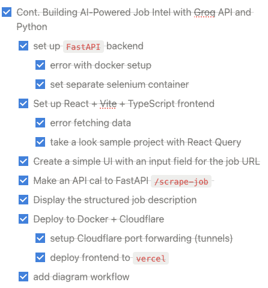

# Job-Intel
[Demo Link](https://job-intel.vercel.app/)

**Job-Intel** is a tool designed to extract and process job-related information from specific URLs. It uses **Selenium** to scrape data, **Groq API** with **Llama 3.3 70B** for intelligent data extraction, and a **system prompt** to ensure the output is in the desired format. The backend is built with **FastAPI**, and the frontend uses **React**, **TypeScript**, and **TanStack Query**. The application is containerized using **Docker** and exposed to the public via **Cloudflare Tunnel**.

---

## Features

- **Automated Data Extraction**: Uses Selenium to scrape job details from target URLs.
- **AI-Powered Insights**: Leverages Groq API and Llama 3.3 70B to extract key information.
- **Consistent Output**: Ensures the extracted data matches the desired format using a system prompt.
- **Modern Frontend**: Built with React, TypeScript, and TanStack Query for a responsive UI.
- **Easy Deployment**: Containerized with Docker and accessible via Cloudflare Tunnel.

---

## Tech Stack

- **Backend**: FastAPI, Selenium, Groq API
- **Frontend**: React, TypeScript, TanStack Query
- **Deployment**: Docker, Cloudflare Tunnel
- **AI Model**: Llama 3.3 70B (via Groq API)

---

## Setup Instructions

### Prerequisites

- Docker
- Node.js 18+
- Python 3.9+
- Groq API Key

### Steps

1. **Clone the Repository**:
   ```bash
   git clone https://github.com/Navong/jobintel-ai.git
   cd job-intel
   ```

2. **Set Up Environment Variables**:
   Create a `.env` file in the `backend` directory:
   ```
   GROQ_API_KEY=your_groq_api_key_here
   ```

3. **Build and Run with Docker**:
   ```bash
   docker-compose up --build
   ```

4. **Access the App**:
   - The app will be available locally or via the Cloudflare Tunnel URL.

---

## Usage

1. Enter a job URL in the frontend.
2. Click "Extract" to scrape and process the data.
3. View the formatted results on the frontend.

---

## Workflow

.png)

---

## Work Process



---

## Result

